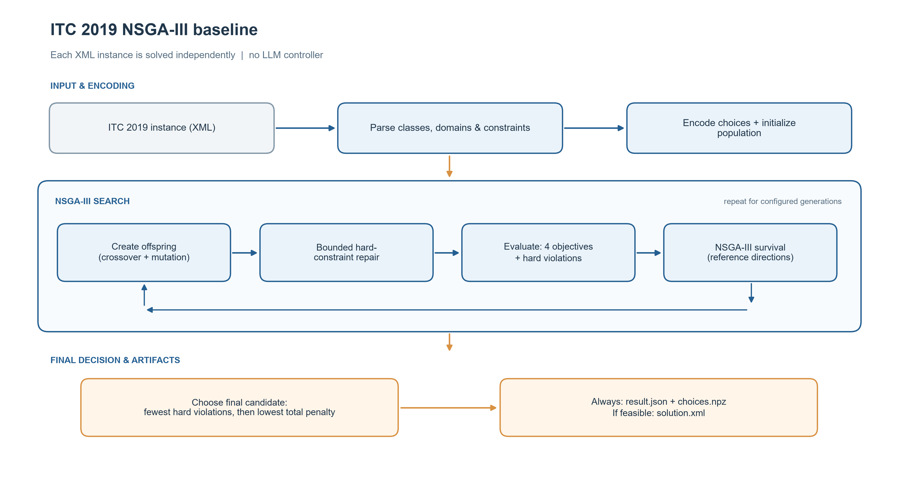

# NSGA-III baseline for ITC 2019

Thư mục này triển khai baseline NSGA-III cho bài toán xếp thời khóa biểu đại học trên các instance ITC 2019. Đây là bộ giải nền để dùng trong nghiên cứu UCTP; phiên bản hiện tại **chưa triển khai LLM controller**.

## Dữ liệu

Baseline đọc các file XML gốc trong thư mục `Dataset_ITC2019`, nằm cùng cấp với thư mục `NSGA-III`:

```text
repository-root/
├── Dataset_ITC2019/
└── NSGA-III/
```

Bộ dữ liệu hiện có 36 instance độc lập: 30 instance thi đấu và 6 test instance. Mỗi file XML là một bài toán riêng. Có thể chạy một instance, danh sách instance hoặc subset qua manifest; không cần cắt nhỏ hay chỉnh sửa XML. Cấu trúc và các ràng buộc được mô tả trong [ITC 2019 problem format](https://www.itc2019.org/format).

Một instance chứa courses, classes, lựa chọn thời gian và phòng, sinh viên, cùng các ràng buộc phân phối giữa các class. Solver chọn giờ và phòng cho từng class, rồi gán sinh viên vào các class phù hợp.

## Pipeline



`main.py` đọc XML, mã hóa lựa chọn thời gian/phòng cho từng class, khởi tạo quần thể và chạy NSGA-III. Mỗi cá thể được đánh giá theo bốn penalty có trọng số: time, room, soft distribution và student conflict. Số vi phạm hard được đưa vào như một constraint. Vòng lặp tìm kiếm sử dụng crossover, mutation, repair giới hạn và lựa chọn theo reference directions.

Ở cuối lần chạy, solver chọn cá thể có ít vi phạm hard nhất; nếu bằng nhau thì chọn cá thể có tổng penalty có trọng số thấp nhất. `weighted_total` dùng để xếp các nghiệm cuối, còn NSGA-III tối ưu đồng thời bốn mục tiêu trong suốt quá trình tìm kiếm.

## Cài đặt và chạy

Yêu cầu Python 3.10 trở lên. Từ thư mục `NSGA-III`:

```powershell
python -m pip install -r requirements.txt
python main.py --instance wbg-fal10 --inspect
python main.py --instance wbg-fal10 --population 40 --generations 20 --seed 42
```

`--inspect` chỉ đọc và tóm tắt instance, không chạy tối ưu. Một lần chạy nhiều instance:

```powershell
python main.py --instance wbg-fal10 --instance lums-sum17 --population 40 --generations 20 --seed 42
```

Để chạy subset, tạo `subset.txt` với một tên instance mỗi dòng (có thể kèm `.xml`):

```text
wbg-fal10
lums-sum17
```

```powershell
python main.py --manifest subset.txt --population 40 --generations 20 --seed 42
```

`python main.py --all` chạy mọi XML trong thư mục dataset, gồm cả sáu test instance, và có thể tốn thời gian trên các instance lớn. Chạy `python main.py --help` để xem các tùy chọn đầy đủ.

| Tham số | Ý nghĩa | Mặc định |
| --- | --- | --- |
| `--dataset DIR` | Thư mục chứa XML | `../Dataset_ITC2019` |
| `--instance NAME` | Instance cần chạy; có thể lặp lại | Không đặt |
| `--manifest FILE` | File danh sách instance, mỗi dòng một tên | Không đặt |
| `--all` | Chạy toàn bộ XML trong thư mục dữ liệu | Tắt |
| `--population N` | Kích thước quần thể | `40` |
| `--generations N` | Số thế hệ | `20` |
| `--partitions N` | Tham số sinh reference directions | `4` |
| `--seed N` | Random seed | `42` |
| `--output DIR` | Thư mục lưu kết quả | `results_itc2019/` |

Với bốn mục tiêu, population phải đủ lớn để chứa các reference directions. Cấu hình mặc định population `40` và partitions `4` đáp ứng điều kiện này.

## Output

Mỗi lần chạy tối ưu tạo một thư mục theo timestamp và seed trong `results_itc2019/`:

```text
results_itc2019/<run-id>/
├── summary.json
└── <instance>/
    ├── result.json
    ├── choices.npz
    └── solution.xml       # chỉ được xuất khi nghiệm đạt điều kiện khả thi nội bộ
```

- `summary.json`: tổng hợp kết quả của các instance trong lần chạy.
- `result.json`: thông tin instance, runtime, số lần đánh giá, cấu hình, tính khả thi và điểm số.
- `choices.npz`: các chỉ số lựa chọn time và room option trong chromosome; có thể xuất hiện cả khi nghiệm chưa khả thi.
- `solution.xml`: lịch và phân công sinh viên của nghiệm mà bộ kiểm tra nội bộ đánh giá là khả thi.

Trong `result.json`, `score.hard` là số vi phạm hard nội bộ ghi nhận; `room_conflicts`, `room_unavailable`, `hard_distributions` và `unassigned_requests` giúp xác định nguồn vi phạm. `score.weighted` ghi bốn penalty sau trọng số, còn `score.total` là tổng của chúng. Chỉ so sánh weighted penalty giữa các nghiệm hợp lệ của cùng một instance.

## Giới hạn và xác minh

Student sectioning hiện dùng heuristic greedy với beam nhỏ. Heuristic này có thể không tìm thấy cách gán sinh viên dù vẫn tồn tại cách gán hợp lệ. Khi đó nghiệm bị ghi nhận có vi phạm hard; kết quả này không chứng minh instance vô nghiệm. Repair và tìm kiếm NSGA-III cũng là heuristic, nên việc không tìm được nghiệm khả thi không phải bằng chứng rằng không có nghiệm.

`solution.xml` chỉ được ghi khi bộ kiểm tra nội bộ đánh giá nghiệm khả thi. Trước khi dùng điểm số trong báo cáo hoặc so sánh nghiên cứu, cần kiểm tra solution bằng [ITC 2019 official validator](https://www.itc2019.org/validator). Validator kiểm tra file nghiệm; nó không tìm nghiệm và cũng không chứng minh một instance vô nghiệm.

Parser và pipeline đã được smoke test trên một số instance. Repository hiện chưa có bộ regression test riêng cho implementation ITC 2019. Chưa có benchmark đầy đủ trên toàn bộ 30 competition instance, cũng chưa có đối chiếu có hệ thống giữa bộ chấm nội bộ và official validator. Vì vậy, nên xem đây là baseline đang được kiểm chứng, chưa phải kết quả solver đạt chuẩn thi đấu.

## Tài liệu tham khảo

- [ITC 2019 problem format](https://www.itc2019.org/format)
- [ITC 2019 official validator](https://www.itc2019.org/validator)
- [ITC 2019 competition paper](https://www.itc2019.org/papers/itc2019-patat2018.pdf)
